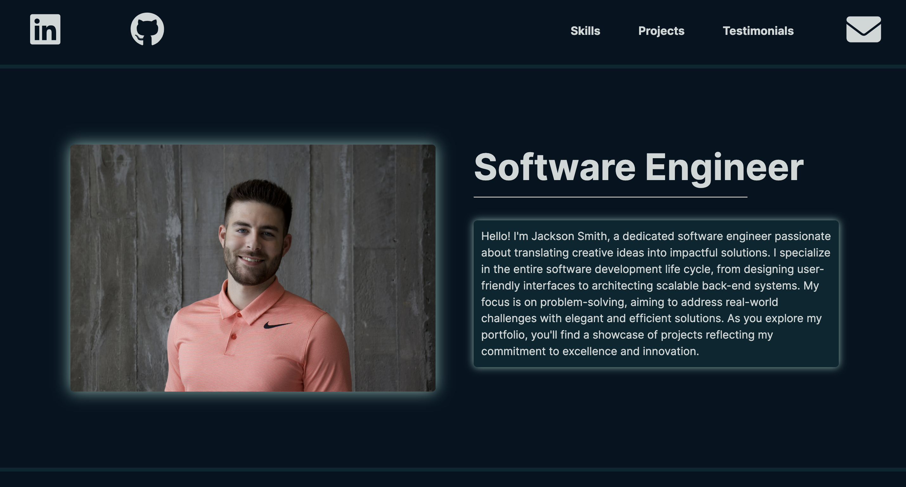

# Jackson Smith's Portfolio Website

Welcome to my portfolio website! This site is built with [Next.js](https://nextjs.org/), a powerful React framework, and showcases my skills, projects, testimonials, and more.

## Skills

I have experience with a wide range of programming languages and technologies, categorized into front-end technologies, back-end technologies, and development tools.

### Front-end Technologies

- HTML
- CSS
- React.js
- Javascript

### Back-end Technologies

- JavaScript
- Go
- Python
- Java
- Node.js
- Express.js
- C++
- PostgreSQL
- MongoDB

### Development Tools

- NPM
- Git
- Github 
- Docker
- Jira
- Figma

## Projects

The portfolio includes the following projects:

1. **MERN Web Scraper** - This application is a robust, full-stack solution developed using the MERN stack (MongoDB, Express.js, React, Node.js). It is designed to efficiently scrape and process data from IMDb's top 1000 movies. | [Live Link](https://imdb-smith-scraper.vercel.app)
2. **ICO Web App** - Developed the Imperial Contracting Ottawa [ICO] Home Renovations website using React.js on the frontend and Node.js and Express.js with Javascript on the backend to showcase our Ottawa-based full home renovation expertise. | [Live Link](https://imperialcontractingottawa.ca/)
